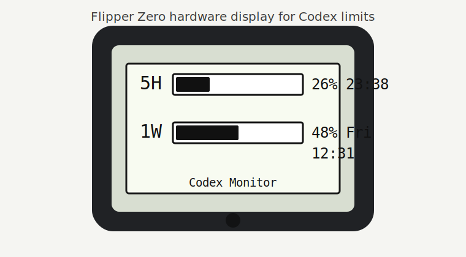

# Codex Monitor for Flipper Zero

[](https://github.com/vk0st/flipper-codex-monitor/actions/workflows/ci.yml)
[](https://github.com/vk0st/flipper-codex-monitor/releases)
[](LICENSE)
[](flipper-app)

Codex Monitor turns a Flipper Zero into a tiny desk display for your Codex account limits. It shows only the two aggregate Codex windows that matter during a work session:

```text
5H  [bar] 26% 23:38
1W  [bar] 48% Fri 12:31
```

The Flipper app is intentionally small. The PC backend reads Codex limits through the local Codex CLI app-server, formats reset times in your computer's local timezone, and sends one compact 21-byte BLE serial packet per second.



## Project Status

This is an early-stage OSS project with a narrow, practical scope: make Codex limits visible on dedicated hardware while keeping Codex auth and account data on the local computer. The current release is aimed at Flipper Zero users who are comfortable building a FAP and running a small Rust backend.

## What Is Inside

- `flipper-app/` - external Flipper FAP named `Codex Monitor`.
- `backend/` - Rust BLE backend that talks to `codex app-server --listen stdio://`.
- `.github/workflows/ci.yml` - backend build/test and FAP build checks.

The original PC Monitor CPU/RAM/GPU telemetry is not included. This fork only sends Codex limit data: 5-hour usage, weekly usage, reset labels, and status.

## Requirements

- Flipper Zero with Bluetooth enabled.
- uFBT for building and installing the FAP.
- Rust toolchain for the backend.
- Codex CLI installed and logged in with ChatGPT.
- A desktop OS with BLE support. Windows is the main tested path.

Check Codex auth first:

```powershell
codex login status
```

## Build And Install

Build and launch the Flipper app:

```powershell
cd flipper-app
ufbt launch FLIP_PORT=COM3
```

Run a backend smoke test:

```powershell
cargo run --manifest-path backend/Cargo.toml -- --smoke-test
```

Start the backend:

```powershell
cargo run --manifest-path backend/Cargo.toml
```

Open `Codex Monitor` on the Flipper before starting the backend. The app advertises as `Codex <flipper-name>`, and the backend connects automatically when it sees that BLE device. You should not need to manually reconnect from Windows Bluetooth settings after the first pairing.

## BLE Contract

The backend reuses the Flipper serial characteristic and sends this packed payload:

```c
typedef struct {
    uint8_t five_hour_used_percent;
    char five_hour_reset[8];   // "HH:MM"
    uint8_t week_used_percent;
    char week_reset[10];       // "Wed HH:MM"
    uint8_t status;            // 0 ok, 1 stale, 2 codex_error, 3 limit_reached
} CodexLimitsPacket;
```

Serialized length is fixed at 21 bytes. The Flipper app does not parse JSON and does not need a clock or timezone configuration.

## Troubleshooting

- If the Flipper keeps showing `Waiting for backend`, make sure the `Codex Monitor` app is actually open and the backend is running.
- If Windows asks for pairing, pair with the device named `Codex ...`, not the default `Flipper ...` device.
- If the backend reports a Codex error, run `cargo run --manifest-path backend/Cargo.toml -- --smoke-test` and verify `codex login status` says you are logged in with ChatGPT.
- If the app stops receiving data, it switches to a lost/stale state after a short timeout.

## Privacy

No Codex credentials are sent to the Flipper. The backend reads limits locally through the Codex CLI and transmits only percentages, reset labels, and a small status byte over BLE.

## Contributing And Security

- See [CONTRIBUTING.md](CONTRIBUTING.md) for setup, tests, and contribution rules.
- See [SECURITY.md](SECURITY.md) for vulnerability reporting and the security model.
- See [ROADMAP.md](ROADMAP.md) for planned work and non-goals.

## Credits

This project is derived from TheSainEyereg's Flipper PC Monitor backend and Flipper app. The BLE serial helper in the FAP is based on Willy-JL's BLE serial fix from Xtreme Apps. The original MIT license and attribution are preserved.
